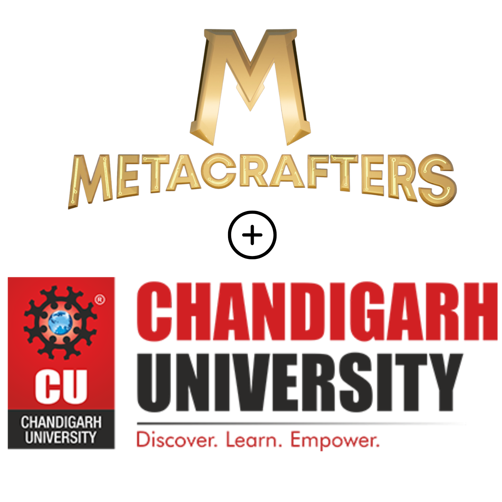

# Summer Training Program with Metacrafters
<h1 align="center">
  

</h1>

  This is the repository for the Summer Training Program at Chandigarh University by MetaCrafters. MetaCrafters is a multichain learn-and-earn platform that teaches users to write smart contracts and build on-chain. 

  
# Description 
This repository contains the code and resources for the assignments and projects required to complete the program on the blockchain technology. By this I am gaining new knowledge and experience on the vast pool of technologies like Ethereum, Solidity, JavaScript, etc.
Moreover I can gain NFTs and many more perks with the help of this summer training. By gaining hands on experience on web3, it can open new opportunities in my career

## Course Overview 

The Training consists of following Courses:

Course 1: JS PROOF: Beginner Course
 

Course 2: ETH PROOF: Beginner Course
 

